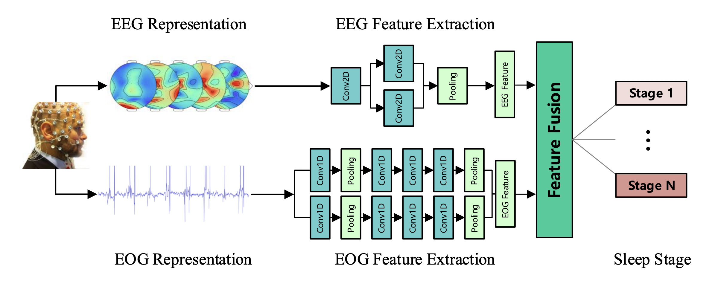

# TS-SEN

Two-Stream Squeeze-and-Excitation Network for Multi-modal Sleep Staging



Two-Stream Squeeze-and-Excitation Network (TS-SEN) is a deep learning model for capturing the features of electroencephalogram (EEG) and electrooculogram (EOG) for sleep staging. The TS-SEN is made up of two independent feature extraction networks for modeling the heterogeneity and a multi-modal Squeeze-and-Excitation feature fusion module for adaptively utilizing the multi-modal signals.

This repository contains the source code of the TS-SEN.

# Dataset

We evaluate our model on the [Montreal Archive of Sleep Studies (MASS) ](http://massdb.herokuapp.com/en/)dataset Subset-3. The MASS dataset is an open-access and collaborative database of laboratory-based polysomnography (PSG) recordings. 

# Requirements

- Python 3.6.2
- CUDA 9.0
- CuDNN 7.6.4
- numpy==1.19.5
- sklearn==0.19.1
- tensorflow_gpu==1.8.0
- Keras==2.2.0

# Usage

- Preprocess

  - Prepare data (raw signals) in `data_dir`
    - Files name: 01-03-00**XX**-Data.npy, where **XX** denotes subject ID.
    - Tensor shape: **[sample, channel=26, length]**, where channel 0 is ECG channel, 1-20 are EEG channels, 21-23 are EMG channels, 24-25 are EOG channels.
  - Modify directory
    - Modify `data_dir` and `label_dir`  in `run_preprocess.py` accordingly.
    - (Optional) Modify `output_dir` in  `run_preprocess.py`.
  - Run preprocess program
    - `cd preprocess`
    - `python run_preprocess.py`

- Training Command Line Arguments

  - Training
    - `--batch_size`: Training batch size.
    - `--epoch`: Number of training epochs.
    - `--num_fold`: Number of folds.
    - `--save_model`: Save the best model or not.
    - `--early_stop`: Use the early stop trick or not.
    - `--gpunums`: Number of GPU(s).
    - `--from_fold`: Training start fold.
    - `--to_fold`: Training end fold.
  - Directory 
    - `--label_dir`: The directory of labels.
    - `--data_dir_eog`: The directory of the EOG signals.
    - `--data_dir_psd`: The directory of the spectral-spatial representation of EEG signals.
    - `--output`:  The directory for saving results.
    - `--model_dir`: The directory for saving the best models of each fold.

- Training

  Run `run.py` with the command line parameters. By default, the model can be run with the following command:

  ```
  CUDA_VISIBLE_DEVICES=0 python run.py
  ```
